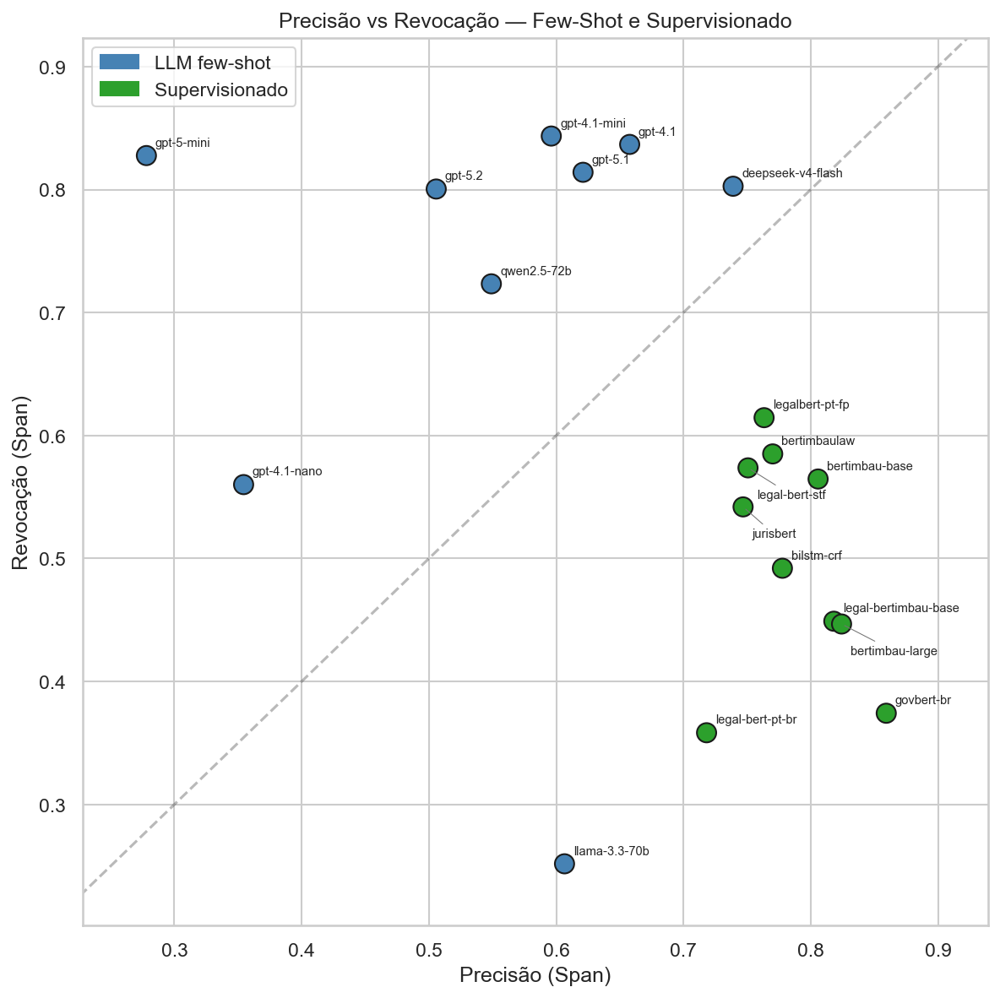

# DeciContas.br

**A Named Entity Recognition dataset of Brazilian audit-court decisions, and a controlled comparison of 19 extraction models on it.**

[](https://creativecommons.org/licenses/by/4.0/)
[](LICENSE)
[](pyproject.toml)

Brazilian **Courts of Accounts** (*Tribunais de Contas*) audit public spending. Their
rulings impose fines, binding obligations, reimbursements to the treasury and
non-binding recommendations — and each of those must be transcribed by hand into an
institutional registry that tracks whether the ruling was complied with. This
repository releases the corpus built to automate that step, together with everything
needed to reproduce the reported results.

The decisions come from the **Court of Accounts of the State of Rio Grande do Norte**
(TCE/RN, *Tribunal de Contas do Estado do Rio Grande do Norte*). It is, to our
knowledge, the first NER dataset over decisions of a Brazilian Court of Accounts.

Companion artefact to the dissertation *"Reconhecimento de Entidades Nomeadas em
Decisões do TCE/RN"* (Named Entity Recognition in TCE/RN Decisions), UFRN.

---

## The four entity types

Labels are kept in Portuguese because they name legal institutes, each with its own
enforcement regime — translating them would misrepresent the corpus.

| Label | What it is | Count |
|---|---|---:|
| `MULTA` | A pecuniary **fine** for administrative or fiscal misconduct | 212 |
| `OBRIGACAO` | A binding **obligation** imposed on the audited body | 131 |
| `RESSARCIMENTO` | A mandated **reimbursement** to the public treasury | 63 |
| `RECOMENDACAO` | A formally documented, non-binding **recommendation** | 53 |

**861 documents, 459 entities.** Only 232 documents carry an entity; the remaining
629 are true negatives — filings and clean-account judgments with no registrable
command. They are kept deliberately: in production the system must also learn *not*
to extract. Spans are long (per-class medians of 185–356 characters), so evaluation
uses partial matching (IoU ≥ 0.5) rather than exact boundaries.

## Get the data

**Download** — grab a single file from the [latest release](https://github.com/eduardoplima/decicontas.br/releases/latest),
no clone required. **Or, in a clone**, the bundles are under [`data/`](data)
(a shortcut to `dataset/release/`).

```python
import json

docs = [json.loads(line) for line in open("data/decicontas/decicontas.jsonl")]
print(len(docs), sum(len(d["spans"]) for d in docs))   # 861 459
```

With HuggingFace `datasets`:

```python
from datasets import load_dataset

ds = load_dataset("json", data_files="data/decicontas/decicontas.jsonl")["train"]
```

One record, abridged:

```jsonc
{
  "id": "69",
  "text": "Vistos, relatados e discutidos estes autos, acatando o entendimento do ...",
  "tokens": ["Vistos,", "relatados", "e", "discutidos", "..."],
  "ner_tags": ["O", "O", "O", "O", "..."],          // BIO, one per token
  "token_offsets": [[0, 7], [8, 17], "..."],        // character span of each token
  "spans": [
    {"start_char": 266,  "end_char": 731,  "label": "MULTA"},
    {"start_char": 921,  "end_char": 1277, "label": "OBRIGACAO"}
  ]
}
```

Four formats ship per release: **JSON**, **JSONL** (HuggingFace-compatible),
**CoNLL-2003** BIO and **BRAT** standoff. See
[`dataset/release/README.md`](dataset/release/README.md) for the schema of each and
[`DATASHEET.md`](dataset/release/DATASHEET.md) for provenance, collection and intended
uses.

> **Schema note.** `decicontas.jsonl` uses `spans` with `start_char`/`end_char` and a
> string `id`; `decicontas.json` uses `entities` with `start`/`end` and an integer
> `id`. Same annotations, different field names — pick one and stay with it.

## Results

Nine instruction-tuned LLMs under few-shot prompting with structured outputs, against
ten supervised baselines (BiLSTM-CRF, BERTimbau base/large, and seven Portuguese
legal- or government-domain encoders). One protocol for all: span F1 with IoU ≥ 0.5,
paired document-level bootstrap (10,000 resamples) and Holm correction.

**Headline.** The best LLM, the open-weights **DeepSeek-V4-Flash** (macro span F1
**0.731**), beats the best domain-adapted encoder, **LegalBert-pt** (**0.637**), by
+0.094 — significant after correction (*p*<sub>Holm</sub> = 0.013). Its gap to GPT-4.1
(0.706) is *not* significant. The advantage concentrates in the minority classes,
which is where a registry-feeding system hurts most.



Supervised models cluster at high precision and low recall; competitive LLMs do the
opposite. That makes LLMs the better pre-annotators for a human-in-the-loop pipeline,
where a reviewer filters false positives more cheaply than hunting omissions.

<details>
<summary><b>Full ranking — 19 models</b> (sorted by macro span F1)</summary>

| Model | Type | Token F1 | Span P | Span R | Span F1 (micro) | Span F1 (macro) |
|---|---|---:|---:|---:|---:|---:|
| DeepSeek-V4-Flash | LLM | 0.809 | 0.737 | 0.769 | 0.753 | **0.731** |
| GPT-4.1 | LLM | 0.800 | 0.656 | 0.802 | 0.722 | 0.706 |
| GPT-5.1 | LLM | 0.770 | 0.614 | 0.773 | 0.685 | 0.675 |
| GPT-4.1-mini | LLM | 0.781 | 0.595 | 0.808 | 0.685 | 0.674 |
| LegalBert-pt | supervised | 0.796 | 0.763 | 0.647 | 0.700 | 0.637 |
| BERTimbauLaw | supervised | 0.767 | 0.770 | 0.616 | 0.684 | 0.622 |
| GPT-5.2 | LLM | 0.742 | 0.503 | 0.765 | 0.607 | 0.585 |
| BERTimbau-base | supervised | 0.768 | 0.799 | 0.589 | 0.679 | 0.580 |
| Qwen2.5-72B | LLM | 0.702 | 0.549 | 0.695 | 0.613 | 0.578 |
| JurisBERT | supervised | 0.720 | 0.747 | 0.558 | 0.639 | 0.568 |
| Legal-BERT-STF | supervised | 0.750 | 0.751 | 0.580 | 0.655 | 0.535 |
| GPT-5-mini | LLM | 0.572 | 0.276 | 0.791 | 0.410 | 0.524 |
| BiLSTM-CRF | supervised | 0.731 | 0.774 | 0.480 | 0.593 | 0.500 |
| BERTimbau-large | supervised | 0.682 | 0.828 | 0.473 | 0.602 | 0.478 |
| GovBERT-BR | supervised | 0.592 | 0.865 | 0.396 | 0.543 | 0.424 |
| Legal-BERTimbau-base | supervised | 0.686 | 0.822 | 0.475 | 0.602 | 0.406 |
| GPT-4.1-nano | LLM | 0.580 | 0.359 | 0.545 | 0.433 | 0.394 |
| LegalBERTPT-br | supervised | 0.573 | 0.718 | 0.377 | 0.495 | 0.341 |
| Llama-3.3-70B | LLM | 0.402 | 0.596 | 0.237 | 0.340 | 0.273 |

Source: [`model_evaluation/C_main_results.csv`](dataset/results/models_outputs/model_evaluation/C_main_results.csv).
</details>

Every number cited in the paper is regenerated into
[`model_evaluation/REPORT.md`](dataset/results/models_outputs/model_evaluation/REPORT.md), one section
per block, each showing its table inline next to the CSV that produced it.

## Annotation quality

Quality is measured, not asserted.

- **Label-error audit.** A confident-learning pass ([cleanlab](https://github.com/cleanlab/cleanlab))
  flagged 794 suspicious token groups; the 567 above an ensemble confidence of 0.95
  were reviewed one by one, and only 23 (4.1%) were actually changed — the audit
  mostly *confirmed* the original annotation. Both versions ship, paired.
- **Inter-annotator agreement.** The whole corpus was independently re-annotated,
  blind, by two staff of the Court unit that feeds the registry. Token-level Fleiss
  κ = **0.865**; pairwise span F1 between **0.776** and **0.838**. Details in
  [`corpus_and_agreement/AGREEMENT.md`](dataset/results/models_outputs/corpus_and_agreement/AGREEMENT.md).

## Reproduce

```bash
uv sync                                                           # install (Python 3.12)
uv run python -m research.release.evaluation_numbers                # all evaluation CSVs + REPORT.md
uv run python -m research.release.regenerate_figures              # the result figures
uv run python -m research.release.bootstrap_significance --quiet  # bootstrap CIs (N=10,000)
uv run pytest tests/                                              # test suite
```

Those run offline from a clean clone — the model outputs they score are versioned.
Two things are **not** needed to reproduce the tables: API credentials (only for
re-running LLM inference) and a GPU.

Re-running the supervised sweep is the expensive part (~13 h on Apple Silicon MPS):

```bash
DECICONTAS_DATASET_PATH=dataset/release/decicontas/decicontas-labelstudio.json \
uv run python -m research.kfold.orchestrate
```

## Repository layout

```
decicontas.br/
├── data/                 # → shortcut to dataset/release/
├── dataset/
│   ├── raw/              # scraped corpora + Label Studio imports (provenance)
│   ├── labeled_data/     # original Label Studio export
│   ├── errors/           # cleanlab audit decisions
│   ├── release/          # publishable bundles + DATASHEET.md + MANIFEST.json
│   └── results/          # models_outputs/ (canonical) + old_experiments/ (archived)
├── notebooks/            # exploratory analysis, baselines, LLM evaluation
├── research/             # the package the notebooks and scripts import
│   ├── dataset_io.py     # canonical tokenisation + BIO construction
│   ├── ner_metrics.py    # token/span F1, IoU bipartite matcher
│   ├── release/          # dataset export, number regeneration, bootstrap
│   └── kfold/            # supervised 5-fold CV
├── scripts/              # analysis + release packaging
└── tests/                # pytest suite
```

## Dataset versions

- **`decicontas/`** — the canonical release: 861 documents with the reviewed
  cleanlab corrections applied.
- **`decicontas-before-correction/`** — the same 861 documents with the original gold
  annotations, so the effect of the audit can be measured.

The 861 come from an 866-document Label Studio export, minus five documents reused
during prompt curation. All five carry no entities.

## Citation

Cite via [`CITATION.cff`](CITATION.cff) — GitHub renders it under *"Cite this
repository"*. A DOI and the BibTeX for the accompanying paper will be added here on
publication.

## License

Dual-licensed, see [`LICENSE`](LICENSE):

- **Data** (`dataset/`) — [CC BY 4.0](https://creativecommons.org/licenses/by/4.0/).
  The underlying decisions are public acts of the TCE/RN; the license covers the
  annotations, tokenisation, release bundles and documentation produced by the authors.
- **Code** (`research/`, `scripts/`, `tests/`, `notebooks/`) — MIT.
